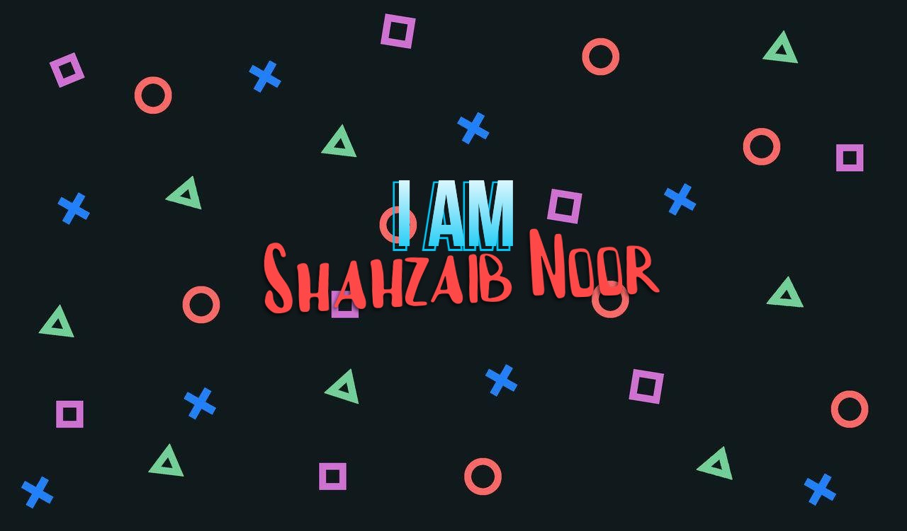

](https://twitter.com/ShahzaibNoor1)
[

[]

](https://medium.com/@shahzaibnoor40)

---

### Hi, I'm Shahzaib 👋

**Senior AI Engineer** specializing in production LLM infrastructure,
multi-agent orchestration, and agentic AI systems.

I build systems that ship — not demos.

9 years of engineering experience across FinTech, Healthcare,
IoT, and SaaS. Based in Karachi, Pakistan.
Available for remote and relocation opportunities globally.

---

### 🧠 What I Build

- **Agentic AI Systems** — LangGraph, OpenAI Agents SDK,
  Model Context Protocol (MCP), multi-agent orchestration,
  autonomous reasoning loops, agent memory & planning

- **Production RAG Pipelines** — Agentic RAG, FAISS, Pinecone,
  hybrid retrieval, semantic search, document intelligence

- **LLM Infrastructure** — Multi-provider architectures
  (OpenAI, Anthropic, Google AI), fallback strategies,
  cost optimization, structured outputs, LLM evaluation

- **Backend & Distributed Systems** — Python, FastAPI, Node.js,
  TypeScript, Kafka, Celery, async pipelines,
  event-driven architecture

- **Full-Stack Delivery** — React, Next.js, TypeScript,
  WebSocket dashboards, real-time interfaces

- **Cloud & DevOps** — AWS, GCP, Docker, Kubernetes,
  Terraform, GitHub Actions, CI/CD, structured observability

---

### 🛠️ Core Stack

---

### 🚀 Featured Projects

#### 🏥 CareCopilot AI — Multi-Agent Healthcare Automation
Production multi-agent platform replacing manual healthcare
administrative workflows with autonomous AI-driven operations.
Multi-step LLM reasoning, Agentic RAG over clinical records,
MCP tool orchestration, and human-in-the-loop approval gates.
**60–70% reduction in administrative workload.**
`LangGraph` `OpenAI Agents SDK` `MCP` `FastAPI` `Kafka` `PostgreSQL`

---

#### 📄 DocuSummarizer Pro — Agentic Document Intelligence
Production RAG system for legal, finance, and research teams.
Agentic retrieval pipelines, multi-step reasoning, and
citation-grounded generation over large document corpora.
**5x improvement in document analysis throughput.**
`LangGraph` `LangChain` `FAISS` `Pinecone` `FastAPI` `Celery`

---

#### 📡 Unified AV & IoT Monitoring — Real-Time Intelligence
High-throughput event intelligence platform processing
thousands of concurrent IoT events per minute with
AI-assisted anomaly detection and automated incident response.
**40% improvement in operational efficiency.**
`Kafka` `Python` `Redis` `Elasticsearch` `WebSockets` `React`

---

### 📝 Technical Writing

- [How to Calculate Convolutional Parameters in CNNs](https://medium.com/@shahzaibnoor40/the-convolution-parameters-calculation-b2394da8dd59)
- [What is Tree Shaking in Angular?](https://medium.com/@shahzaibnoor40/this-is-a-new-and-exciting-day-as-angular-enthusiast-because-angular-9-has-been-released-with-ivy-6abb1e3cbfa0)

---

### 📊 GitHub Stats

---

### 💬 Get in Touch

I'm open to remote roles, contract engagements,
and relocation opportunities globally.

📧 shahzaibnoor40@gmail.com
🔗 [linkedin.com/in/shahzaib-noor-0a1b71b4](https://www.linkedin.com/in/shahzaib-noor-0a1b71b4/)

---

> *"The best code is the code that ships, runs reliably,
> and solves a real problem."*